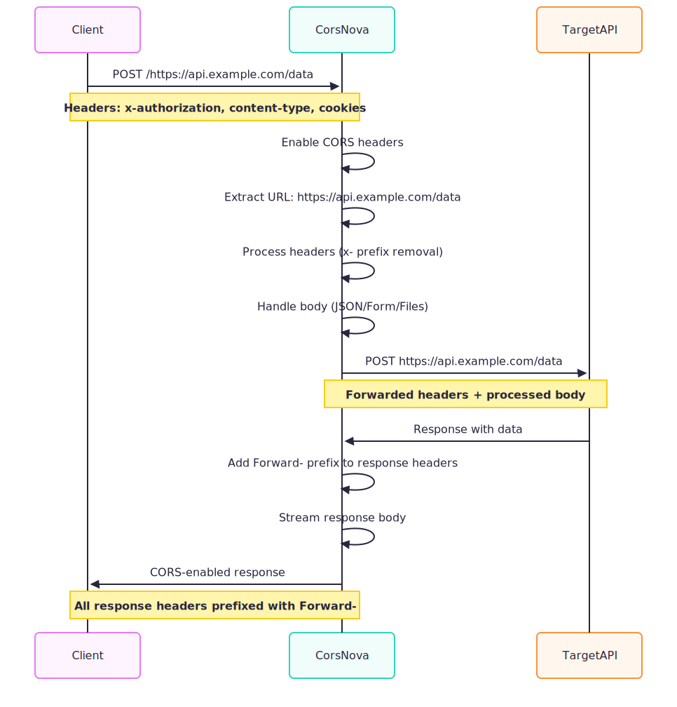

# CorsNova

<p align="center">
  
</p>

A lightweight CORS proxy server built with Express.js. It is designed to run as a Vercel serverless function and helps bypass CORS restrictions during development and testing.

## Features

- **Universal CORS Proxy**: Forwards requests to any public target URL.
- **SSRF Protection**: Blocks private, loopback, link-local and multicast addresses (including DNS-rebinding attempts).
- **Rate Limiting**: Built-in per-IP token bucket to reduce abuse.
- **Content-Type Support**:
  - `application/json`
  - `application/x-www-form-urlencoded`
  - `multipart/form-data` (file uploads supported)
- **Header Management**:
  - Forwards custom request headers prefixed with `x-` (e.g., `x-authorization` becomes `Authorization`).
  - Forwards cookies from the client to the target server.
  - Forwards all response headers from the target server to the client, prefixed with `Forward-` (e.g., `Content-Type` becomes `Forward-Content-Type`).
  - The upstream `Content-Type` is also set on the response so browsers and HTTP clients can parse the body automatically.
- **Streaming**: Streams responses from the target server back to the client.
- **Safe CORS**: Reflects the request `Origin` and sets `Access-Control-Allow-Credentials: true` only when an origin is provided; otherwise it returns `Access-Control-Allow-Origin: *`.

## Requirements

- [Node.js](https://nodejs.org/) 22.x
- A Vercel account (for deployment)

## Installation

1. Clone this repository.
2. Run `npm install` in the repository directory.
3. Start the application with `npm run start` or `node app.js`.
4. The server will run on the port specified by the `PORT` environment variable, or `3030` by default.

## Testing

```bash
npm test              # run the full test suite
npm run test:coverage # run tests with coverage
npm run lint          # run ESLint
```

## Usage

Send your request to the CorsNova server, specifying the target URL as the path:

```
https://<your-vercel-domain>/<target_url>
```

Example:

```
https://<your-vercel-domain>/https://example.com/api/data
```

### Request Forwarding

- All HTTP methods are supported.
- Request headers prefixed with `x-` are forwarded without the prefix.
- Cookies are forwarded.
- Request body is forwarded as-is, supporting JSON, URL-encoded, and multipart forms (including files).
- The default `User-Agent` is `CorsNova/1.0`. Send `x-user-agent` to override it.

### Response Forwarding

- All response headers from the target server are sent back to the client, prefixed with `Forward-`.
- The response body is streamed directly to the client.

## Example

To send a POST request with a custom `Authorization` header and form data to `https://www.example.com`:

```javascript
const formData = new FormData();
formData.append('key1', 'value1');
formData.append('key2', 'value2');
// Append files if needed
// formData.append('myFile', fileInputElement.files[0]);

fetch('https://<your-vercel-domain>/https://www.example.com', {
  method: 'POST',
  headers: {
    // Prefix custom headers with 'x-'
    'x-authorization': 'Bearer YOUR_TOKEN_HERE'
  },
  body: formData
})
.then(response => {
  // Access forwarded headers using the 'Forward-' prefix
  console.log('Forwarded Content-Type:', response.headers.get('Forward-Content-Type'));
  return response.json(); // or response.text(), response.blob(), etc.
})
.then(data => {
  console.log('Success:', data);
})
.catch(error => {
  console.error('Error:', error);
});
```

The proxy will make a POST request to `https://www.example.com` with the `Authorization: Bearer YOUR_TOKEN_HERE` header and the provided form data.

## Deployment on Vercel

1. Push the repository to GitHub.
2. Import the project in the [Vercel dashboard](https://vercel.com).
3. Vercel will detect `app.js` as a Node.js 22 serverless function via `vercel.json`.
4. Deploy.

### Vercel-specific limits

- Request/response body size is capped by Vercel (4.5 MB on Hobby by default). The application enforces a 4 MB body limit to match.
- Function execution time is capped by `maxDuration` in `vercel.json` (30 seconds by default).
- Functions run in the regions configured in `vercel.json` (`fra1` and `iad1` by default).

## Environment variables

| Variable | Default | Description |
|---|---|---|
| `PORT` | `3030` | Local development port. |
| `REQUEST_TIMEOUT_MS` | `25000` | Upstream request timeout in milliseconds. |
| `DEFAULT_USER_AGENT` | `CorsNova/1.0 (...)` | Default `User-Agent` sent to upstream targets. |
| `RATE_LIMIT_PER_MINUTE` | `100` | Maximum requests per IP per minute. |
| `VERCEL` | — | Set automatically by Vercel. Prevents `app.listen()` when present. |

## Security notes

- Private IP ranges, loopback addresses, link-local addresses and metadata endpoints are blocked to prevent SSRF.
- Only `http:` and `https:` target URLs are allowed.
- Embedded credentials in target URLs are rejected.
- The proxy is public by default. If you need access control, place it behind an authentication layer or fork and add a shared-secret gate.

## License

MIT License

## Acknowledgments

Inspired by [`allOrigins`](https://github.com/gnuns/allOrigins) by gnuns and [`cors-anywhere`](https://github.com/Rob--W/cors-anywhere) by Rob Wu.
